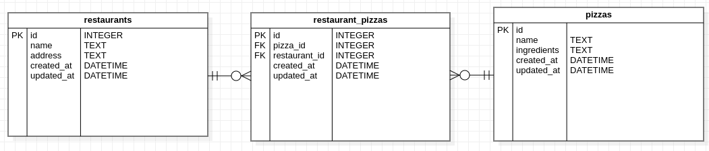

[](https://github.com/Malcolm-G/project-app-backend/graphs/commit-activity)
[](https://github.com/Malcolm-G/project-app-backend/network)
[](https://github.com/Malcolm-G/project-app-backend/blob/main/Licence)
[](http://makeapullrequest.com)
[](https://svgshare.com/i/Zhy.svg)
[](https://github.com/ellerbrock/open-source-badges/)

# Project-App
Project-App is a web application built with react and using Sinatraas the backend API.

This repository contains the backend built with ruby's Sinatra DSL.

The application has been built with the MVC design pattern.

## Pre-Requisites
In order to use this repository you will need the following:


- Operating System **(Windows `10+`, Linux `3.8+`, or MacOS X `10.7+`)**
- RAM >= 4GB
- Free Space >= 2GB

## Built With
This application has been built with the following tools:


- **Ruby `v2.7.+`**
- **SQlite3 `v1.6`**
- **ActiveRecord `v7.0.4`**
- **Rake `v13.0.6`**
- **Puma `v6.1`**
- **Rails `v7.0.4`**
- **active_model_serializers `v0.10.13`**
- **faker `v3.1.1`**

## Setup
You can setup this repository by following this manual

1. Clone the repository
    ```{shell}
   git clone https://github.com/Malcolm-G/p-4-code-challenge-pizzas.git
   ```
2. Ensure the ruby gems are setup in your machine
    ```{shell}
   bundle install
   ```
3. Perform any pending database migrations
   ```{shell}
   rails db:migrate
   ```
4. Run the application
    ```{shell}
    rails s
    ```
5. Open the application from your browser
    ```
   http://localhost:3000
   ```
   
## Application
This application is a simple web API that allows users to:

- View existing restaurants
- Delete a restaurant
- View a specific restaurant and its pizzas
- View all pizzas
- Add a pizza to a restaurant
  
### Below is an ERD diagram of the database.



### MODELS
Database schema definitions.

#### Restaurants

| COLUMN      | DATA TYPE                                       | DESCRIPTION                         | 
|-------------|-------------------------------------------------|-------------------------------------|
| id          | Integer                                         | Unique identifier.                  |
| name       | String                                          | The name of the restaurant.            |
| address | String                                          | Address of restaurant |
| created_at  | DateTime                                        | The date the restaurant was created.      |
| updated_at  | DateTime                                        | The date the restaurant was updated    |


#### Pizzas
| COLUMN        | DATA TYPE | DESCRIPTION                           | 
|---------------|-----------|---------------------------------------|
| id            | Integer   | Unique identifier.                    |
| name     | String    | Pizza's name                     |
| ingredients | String    | string of pizza ingredients |
| created_at  | DateTime                                        | The date the pizza was created.      |
| updated_at  | DateTime                                        | The date the pizza was updated    |

#### RestaurantPizzas
| COLUMN        | DATA TYPE | DESCRIPTION                           | 
|---------------|-----------|---------------------------------------|
| id            | Integer   | Unique identifier.                    |
| price     | Integer    | Price of Pizza                     |
| pizza_id | Integer    | Foreign key to pizza |
| restaurant_id | Integer    | Foreign key to restaurant |
| created_at  | DateTime                                        | The date the join table was created.      |
| updated_at  | DateTime                                        | The date the join table was updated    |


### ROUTES

1. GET `/restaurants` - Presents a list of all restaurants
2. GET `/restaurants/:id` - Shows specific restaurant and its pizzas
3. DELETE `/restaurants/:id` - Delete a restaurant and its restaurant pizzas. Returns an empty body.
4. GET `/pizzas` - Presents a list of pizzas
5. POST `/restaurant_pizzas` - creates a new restaurant_pizza.
   
   ```{json}
   ## RESPONSE SAMPLE
   {
   "price": 5,
   "pizza_id": 1,
   "restaurant_id": 3
   }
   ```

<!--  -->

## LICENSE
This repository is distributed under the GNU GENERAL PUBLIC LICENSE v3

```markdown
Copyright 2023 Malcolm Githuka

Permission is hereby granted, free of charge, to any person obtaining a copy of this software and associated documentation files (the “Software”), 
to deal in the Software without restriction, including without limitation the rights to use, copy, modify, merge, publish, distribute, sublicense, and/or sell copies of the Software, 
and to permit persons to whom the Software is furnished to do so, subject to the following conditions:

The above copyright notice and this permission notice shall be included in all copies or substantial portions of the Software.

THE SOFTWARE IS PROVIDED “AS IS”, WITHOUT WARRANTY OF ANY KIND, EXPRESS OR IMPLIED, INCLUDING BUT NOT LIMITED TO THE WARRANTIES OF MERCHANTABILITY, FITNESS FOR A PARTICULAR PURPOSE AND NONINFRINGEMENT. 
IN NO EVENT SHALL THE AUTHORS OR COPYRIGHT HOLDERS BE LIABLE FOR ANY CLAIM, DAMAGES OR OTHER LIABILITY, WHETHER IN AN ACTION OF CONTRACT, TORT OR OTHERWISE, ARISING FROM, OUT OF OR IN CONNECTION WITH THE SOFTWARE OR THE USE OR OTHER DEALINGS IN THE SOFTWARE.
```

## Author
This repository is maintained by:

- [Malcolm Githuka](https://github.com/Malcolm-G)
